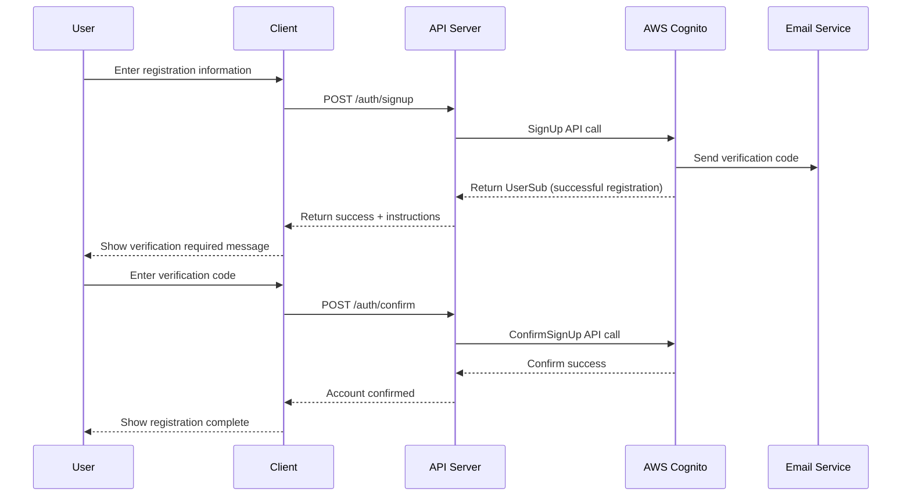
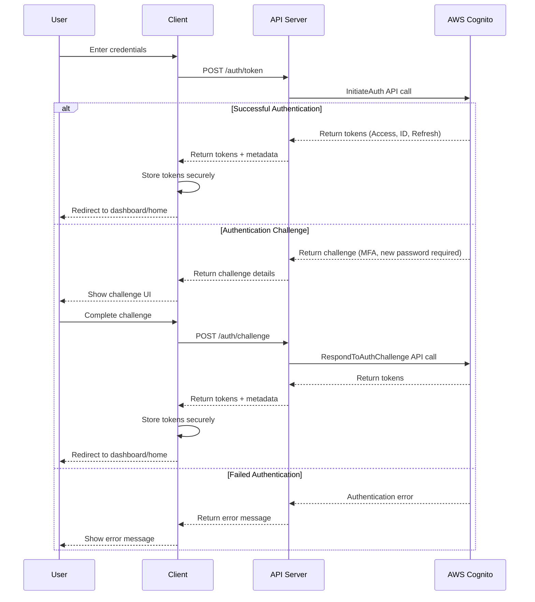
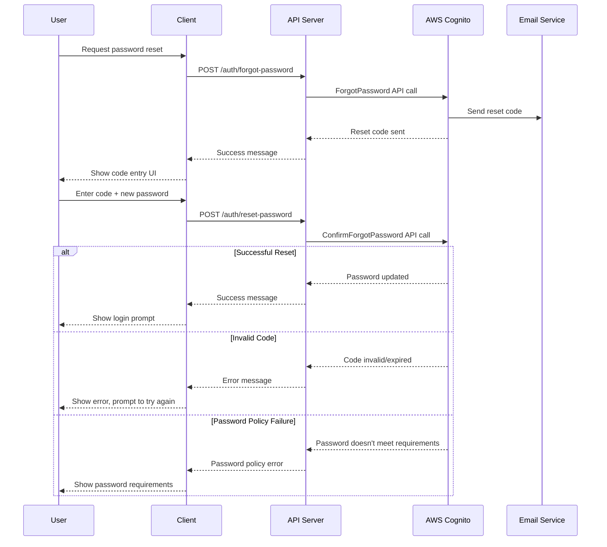
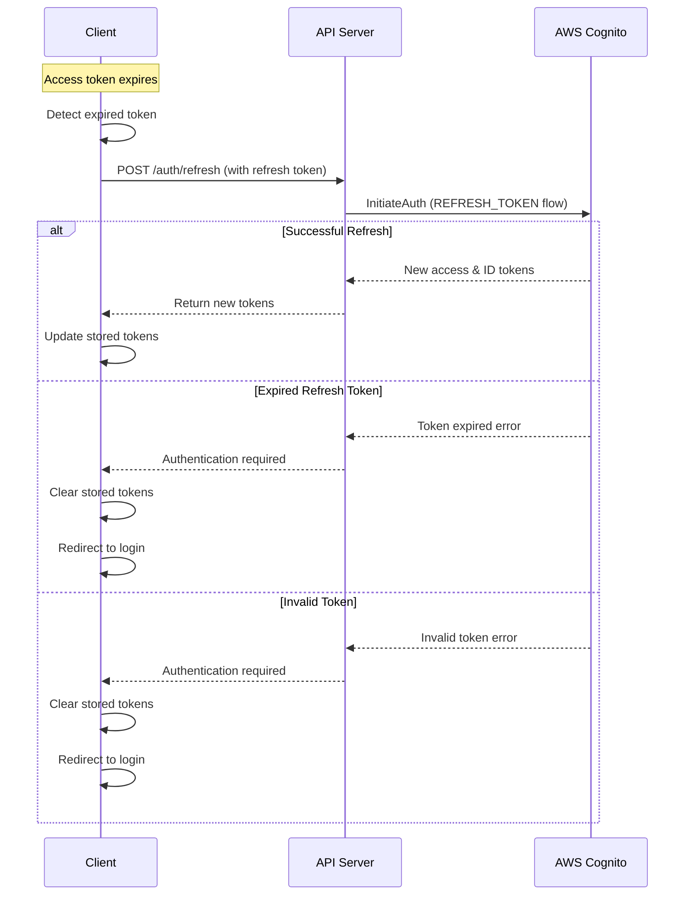
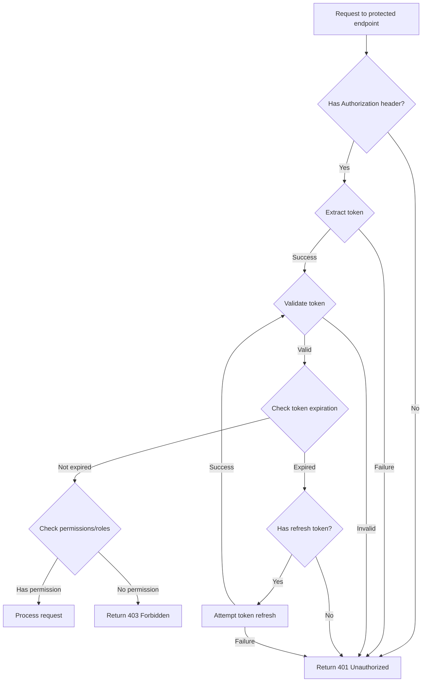
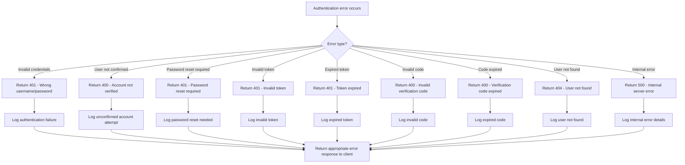

# Authentication Flow Diagrams

This document contains the flow diagrams for the Cognito authentication system implemented in the Experimentation Platform.

## 1. Registration and Confirmation Flow

## 2. Sign-in and Token Issuance Flow

## 3. Password Reset Flow

## 4. Token Refresh Mechanism

## 5. Authorization Decision Flow

## 6. Error Handling Flow

These diagrams provide a comprehensive visual documentation of the authentication flows in the system. They can be used for developer reference, onboarding, and architectural documentation.
